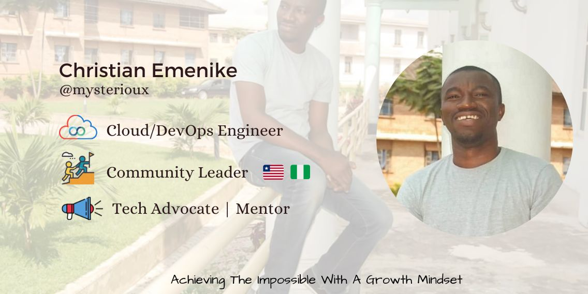

<h1> Hello fellow citizens of the world</h1>
<h2> 💁🏻‍♂️👇 Welcome to my profile page👇</h2>
</h2>
 

- I switched focus from Product Management to Cloud/DevOps Engineering full time. I would really love to grow and help others interested in becoming a Cloud Architect or DevOps Engineer especially in Africa (Liberia/Nigeria). Building communities that thrive and increase open-source collaborations and creating technology to elevate people
- I'm a business-oriented technologist with few years of experience helping startup to dive into technology
- Working to build experience in CI/CD pipelines, Containers, Kubernetes, DevOps and Security.
- My main goal is to improve my professional skills while recreating & redesigning projects in a wide range of technologies.
- I hope to take up challenging position where I can effectively contribute my technical skills and help me grow as an individual and acutely gain business knowledge.
- I love community development as I am a pioneer in many of the communities in Libeira including:
  * [GDG Monrovia](https://gdg.community.dev/gdg-monrovia)
  * [WordPress Monrovia](https://www.meetup.com/monrovia-wordpress-meetup/)
  * Python Liberia
  * [DevCom Liberia
  * Cloud & DevOps Liberia (Working on this)
  * freeCodeCamp Liberia 
  to mention a few

# TECH STACK
  ###  Languages (I have been excelling in)
  
      🐍 Python
      🤖 Bash
      🦾 Power Shell (Beginner)
      📦 Javascript (Beginner)
      
 

### Working Certifications
      • AWS Cloud Practitioner
      • AWS Certified Solution Architect - Associate
      • Azure Cloud Fundamental – (AZ-900) 

 

### Support or Contact

👨🏻‍💻Please feel free to get in touch, I'll be happy to help!💁🏻‍♂️ [Email](hello@ccemenike.me)

####

  

 

 
#### Top Repositories

